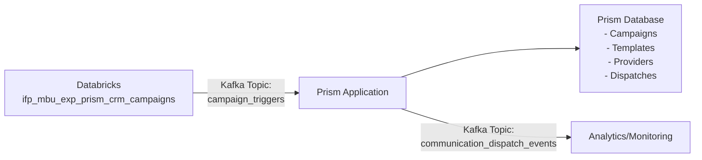
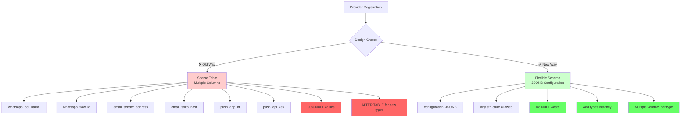
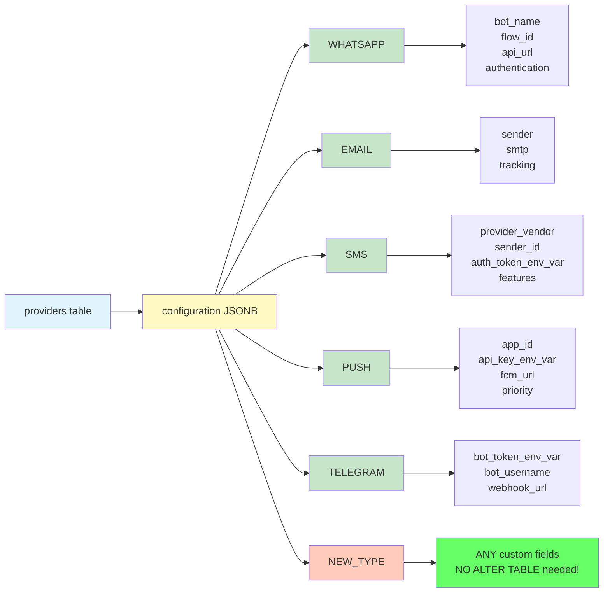
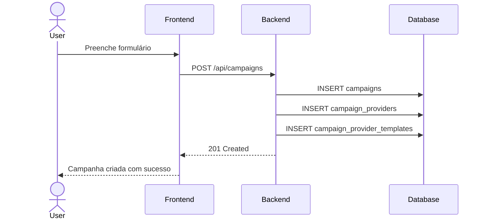
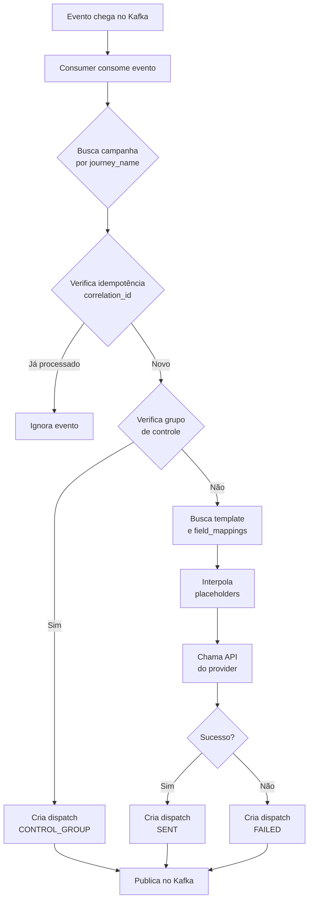
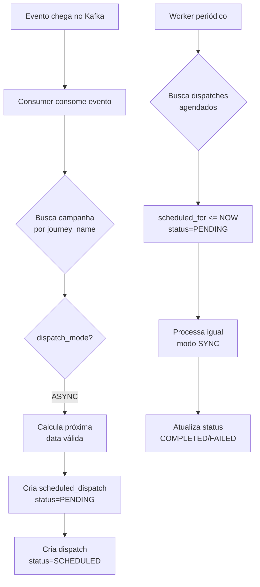
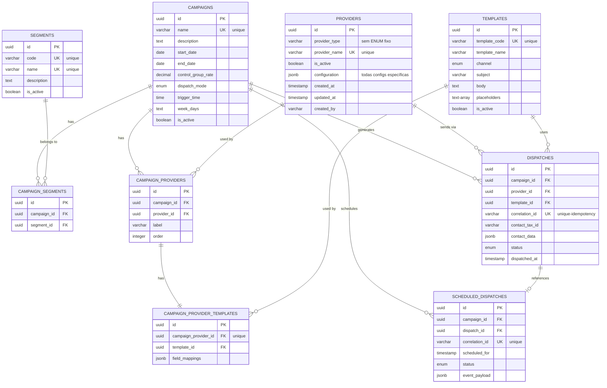

# Prism - Documentação de Arquitetura do Banco de Dados

## Visão Geral do Sistema

O Prism é uma plataforma de orquestração de campanhas multi-canal que permite ao time de Growth gerenciar comunicações através de WhatsApp, Push Notifications, Email e Agentes de IA. O sistema opera em uma arquitetura orientada a eventos, consumindo intenções de campanha do Databricks via Kafka e publicando resultados dos disparos.

## Arquitetura de Integração



---

## Modelo de Dados Conceitual

### Entidades Principais

O banco de dados é organizado em torno de 9 entidades principais:

  1. Campaigns - Configurações das campanhas criadas pelo usuário
  2. Segments - Segmentos de audiência pré-cadastrados (ex: novos usuários, VIPs, etc.)
  3. Campaign_Segments - Relacionamento N:N entre campanhas e segmentos
  4. Providers - Provedores de comunicação (APIs de WhatsApp, Email, Push, etc.)
  5. Campaign_Providers - Relacionamento N:N entre campanhas e provedores (SEM limite por tipo)
  6. Templates - Templates de mensagens pré-cadastrados com placeholders
  7. Campaign_Provider_Templates - Templates específicos para cada provider de cada campanha
  8. Dispatches - Histórico de todas as comunicações enviadas
  9. Scheduled_Dispatches - Fila de disparos agendados (modo ASYNC)

---

## Tabelas e Relacionamentos

### 1. campaigns

**Propósito:** Armazena as configurações de campanhas criadas através da interface web do Prism.

**Conceito:** Cada campanha define como e quando uma comunicação deve ser disparada quando um evento chega do Kafka. A campanha é identificada pelo `name` que serve como chave de negócio para correlacionar com os eventos do Databricks.

  | Coluna             | Tipo      | Descrição                                                                    |
  |--------------------|-----------|------------------------------------------------------------------------------|
  | id                 | UUID      | Identificador único interno                                                  |
  | name               | VARCHAR   | Nome único da campanha (ex: "black_friday_credit_2024")                      |
  | description        | TEXT      | Descrição da campanha                                                        |
  | start_date         | DATE      | Data de início da campanha                                                   |
  | end_date           | DATE      | Data de fim da campanha                                                      |
  | control_group_rate | DECIMAL   | % de contatos que não receberão comunicação (grupo de controle para análise) |
  | dispatch_mode      | ENUM      | SYNC (imediato) ou ASYNC (agendado)                                          |
  | trigger_time       | TIME      | Horário do dia para disparo (apenas ASYNC)                                   |
  | week_days          | TEXT      | Dias da semana permitidos: "1,2,3,4,5" = seg-sex                             |
  | is_active          | BOOLEAN   | Se a campanha está ativa                                                     |
  | created_at         | TIMESTAMP | Data de criação                                                              |
  | created_by         | VARCHAR   | Usuário que criou                                                            |

**Regras de Negócio:**
  - name deve ser único
  - Se dispatch_mode = 'ASYNC', os campos trigger_time e week_days são obrigatórios
  - Se dispatch_mode = 'SYNC', disparo é imediato ao receber evento do Kafka
  - start_date deve ser <= end_date
  - Uma campanha pode ter múltiplos segmentos (via campaign_segments)
  - Uma campanha pode ter múltiplos provedores de qualquer tipo (via campaign_providers)

**Exemplo:**
  {
    "name": "black_friday_credit_2024",
    "description": "Campanha de Black Friday para clientes elegíveis",
    "start_date": "2024-11-20",
    "end_date": "2024-11-30",
    "control_group_rate": 10.0,
    "dispatch_mode": "ASYNC",
    "trigger_time": "14:00:00",
    "week_days": "1,2,3,4,5"
  }

---

### 2. segments

**Propósito:** Cadastro de segmentos de audiência que podem ser vinculados às campanhas.

**Conceito:** Segmentos representam grupos específicos de contatos (ex: novos usuários, VIPs, risco de churn). Uma campanha pode ser direcionada a múltiplos segmentos simultaneamente.

  | Coluna      | Tipo      | Descrição                                |
  |-------------|-----------|------------------------------------------|
  | id          | UUID      | Identificador único                      |
  | code        | VARCHAR   | Código único do segmento (ex: "seg_new_users") |
  | name        | VARCHAR   | Nome amigável (ex: "Novos usuários (D0–D7)") |
  | description | TEXT      | Descrição detalhada do segmento          |
  | is_active   | BOOLEAN   | Se o segmento está ativo                 |
  | created_at  | TIMESTAMP | Data de criação                          |
  | created_by  | VARCHAR   | Usuário que criou                        |

**Regras de Negócio:**
  - code deve ser único
  - name deve ser único

**Exemplo:**
  {
    "code": "seg_high_ltv",
    "name": "Alta Recorrência / LTV",
    "description": "Clientes com alto valor de vida útil e alta recorrência de transações",
    "is_active": true
  }

---

### 3. campaign_segments

**Propósito:** Relacionamento N:N entre campanhas e segmentos.

**Conceito:** Permite que uma campanha seja direcionada a múltiplos segmentos simultaneamente. Por exemplo, uma campanha pode atingir tanto "Novos usuários" quanto "VIPs Black Friday".

  | Coluna      | Tipo    | Descrição                  |
  |-------------|---------|----------------------------|
  | id          | UUID    | Identificador único        |
  | campaign_id | UUID FK | Referência à campanha      |
  | segment_id  | UUID FK | Referência ao segmento     |
  | created_at  | TIMESTAMP | Data de vinculação       |

**Regras de Negócio:**
  - Constraint única: (campaign_id, segment_id) - evita duplicação
  - Uma campanha pode ter 0 ou mais segmentos
  - Um segmento pode estar em múltiplas campanhas

---

### 4. providers

**Propósito:** Cadastro de provedores de comunicação com credenciais e configurações.

**Conceito:** Cada provedor representa uma integração com uma API externa (ex: Blip para WhatsApp, SendGrid para Email). Provedores são pré-cadastrados e reutilizados entre campanhas.

  | Coluna               | Tipo    | Descrição                                            |
  |----------------------|---------|------------------------------------------------------|
  | id                   | UUID    | Identificador único                                  |
  | provider_type        | ENUM    | WHATSAPP, PUSH, EMAIL, AI_AGENT                      |
  | provider_name        | VARCHAR | Nome amigável do provedor (ex: "Blip WhatsApp Prod") |
  | is_active            | BOOLEAN | Se o provedor está ativo                             |
  | WhatsApp específico  |         |                                                      |
  | whatsapp_bot_name    | VARCHAR | Nome do bot no Blip                                  |
  | whatsapp_flow_id     | VARCHAR | ID do fluxo conversacional                           |
  | Push específico      |         |                                                      |
  | push_app_id          | VARCHAR | ID da aplicação                                      |
  | push_api_key         | TEXT    | Chave da API (criptografada)                         |
  | Email específico     |         |                                                      |
  | email_sender_address | VARCHAR | Email remetente                                      |
  | email_sender_name    | VARCHAR | Nome do remetente                                    |
  | email_smtp_host      | VARCHAR | Host SMTP                                            |
  | email_smtp_port      | INTEGER | Porta SMTP                                           |
  | email_smtp_username  | VARCHAR | Usuário SMTP                                         |
  | email_smtp_password  | TEXT    | Senha SMTP (criptografada)                           |
  | AI Agent específico  |         |                                                      |
  | ai_agent_blip_bot_id | VARCHAR | ID do bot de IA na Blip                              |
  | Outros               |         |                                                      |
  | extra_config         | JSONB   | Configurações adicionais flexíveis                   |

**Regras de Negócio:**
  - Campos sensíveis (api_key, smtp_password) devem ser criptografados
  - Cada provider_type tem campos específicos relevantes
  - (provider_type, provider_name) deve ser único

---

### 🚨 IMPORTANTE: Design de Configurações de Providers

#### ❌ Problema da Abordagem Atual (Colunas Específicas)

A abordagem atual com colunas específicas para cada tipo de provider apresenta problemas de escalabilidade:

**Limitações:**
- **Sparse Table:** 90% das colunas ficam NULL para cada registro
- **Schema Rígido:** Adicionar novo tipo (SMS, Telegram, RCS) requer ALTER TABLE + Deploy
- **Manutenção Difícil:** Centenas de colunas potenciais para dezenas de tipos
- **Não Extensível:** Não suporta múltiplos vendors do mesmo tipo (ex: Twilio SMS vs AWS SNS SMS)

**Exemplo do problema:**
```sql
-- Para adicionar SMS, seria necessário:
ALTER TABLE providers ADD COLUMN sms_api_url VARCHAR;
ALTER TABLE providers ADD COLUMN sms_api_key TEXT;
ALTER TABLE providers ADD COLUMN sms_sender_id VARCHAR;
ALTER TABLE providers ADD COLUMN sms_provider_vendor VARCHAR;

-- Para adicionar Telegram:
ALTER TABLE providers ADD COLUMN telegram_bot_token TEXT;
ALTER TABLE providers ADD COLUMN telegram_api_url VARCHAR;

-- Para adicionar RCS, Discord, Slack... infinitas colunas!
```

---

#### ✅ Solução Recomendada: JSONB Configuration

**Design Melhorado:** Usar apenas JSONB para toda configuração específica.



```sql
CREATE TABLE providers (
  id UUID PRIMARY KEY DEFAULT gen_random_uuid(),
  provider_type VARCHAR NOT NULL,  -- Sem ENUM fixo!
  provider_name VARCHAR NOT NULL UNIQUE,
  is_active BOOLEAN DEFAULT true,

  -- 🎯 TODA configuração em JSON
  configuration JSONB NOT NULL,

  -- Metadados
  created_at TIMESTAMP DEFAULT NOW(),
  updated_at TIMESTAMP DEFAULT NOW(),
  created_by VARCHAR,

  -- Constraints
  CONSTRAINT valid_config CHECK (jsonb_typeof(configuration) = 'object')
);

-- Índices
CREATE INDEX idx_providers_type ON providers(provider_type);
CREATE INDEX idx_providers_active ON providers(is_active) WHERE is_active = true;
CREATE INDEX idx_providers_config_gin ON providers USING GIN(configuration);
```

---

#### 📊 Estrutura JSONB por Tipo de Provider



---

#### 📋 Exemplos de Cadastro com JSONB

**WhatsApp (Blip):**
```sql
INSERT INTO providers (provider_type, provider_name, configuration)
VALUES (
  'WHATSAPP',
  'Blip WhatsApp - Bot Principal',
  '{
    "bot_name": "bot-growth-campaigns-prod",
    "flow_id": "flow_credit_offer_v3",
    "api_url": "https://msging.net/messages",
    "bot_identifier": "bot-growth@msging.net",
    "authentication": {
      "type": "bearer_token",
      "token_env_var": "BLIP_API_TOKEN"
    }
  }'::jsonb
);
```

**Email (SendGrid):**
```sql
INSERT INTO providers (provider_type, provider_name, configuration)
VALUES (
  'EMAIL',
  'SendGrid - Marketing Principal',
  '{
    "sender": {
      "email": "noreply@ifood.com.br",
      "name": "iFood Growth Team"
    },
    "smtp": {
      "host": "smtp.sendgrid.net",
      "port": 587,
      "username": "apikey",
      "password_env_var": "SENDGRID_PASSWORD"
    },
    "tracking": {
      "enabled": true,
      "click_tracking": true,
      "open_tracking": true
    }
  }'::jsonb
);
```

**SMS (Twilio) - NOVO TIPO SEM ALTER TABLE:**
```sql
INSERT INTO providers (provider_type, provider_name, configuration)
VALUES (
  'SMS',
  'Twilio SMS - Brasil',
  '{
    "provider_vendor": "twilio",
    "account_sid": "ACxxxxxxxxxxxxxxxxxxxxxxxxxxxxx",
    "auth_token_env_var": "TWILIO_AUTH_TOKEN",
    "sender_id": "+5511999999999",
    "messaging_service_sid": "MGxxxxxxxxxxxxxxxxxxxxxxxxxxxxx",
    "api_url": "https://api.twilio.com/2010-04-01",
    "features": {
      "short_urls": true,
      "delivery_receipts": true,
      "character_limit": 160
    }
  }'::jsonb
);
```

**SMS (AWS SNS) - MESMO TIPO, VENDOR DIFERENTE:**
```sql
INSERT INTO providers (provider_type, provider_name, configuration)
VALUES (
  'SMS',
  'AWS SNS - Global',
  '{
    "provider_vendor": "aws_sns",
    "region": "us-east-1",
    "access_key_id_env_var": "AWS_ACCESS_KEY_ID",
    "secret_access_key_env_var": "AWS_SECRET_ACCESS_KEY",
    "sender_id": "iFood",
    "sms_type": "Transactional",
    "max_price": "0.50"
  }'::jsonb
);
```

**Telegram - NOVO TIPO SEM ALTER TABLE:**
```sql
INSERT INTO providers (provider_type, provider_name, configuration)
VALUES (
  'TELEGRAM',
  'Telegram Bot - Notificações',
  '{
    "bot_token_env_var": "TELEGRAM_BOT_TOKEN",
    "bot_username": "@ifood_notifications_bot",
    "api_url": "https://api.telegram.org",
    "webhook_url": "https://prism.ifood.com.br/webhooks/telegram",
    "features": {
      "inline_keyboard": true,
      "markdown": true
    }
  }'::jsonb
);
```

---

#### 🔍 Queries com JSONB

**Buscar providers por vendor específico:**
```sql
SELECT *
FROM providers
WHERE provider_type = 'SMS'
  AND configuration->>'provider_vendor' = 'twilio';
```

**Buscar providers com feature específica:**
```sql
SELECT *
FROM providers
WHERE provider_type = 'SMS'
  AND configuration->'features'->>'delivery_receipts' = 'true';
```

**Validar configuração (exemplo de função):**
```sql
CREATE OR REPLACE FUNCTION validate_sms_config(config JSONB)
RETURNS BOOLEAN AS $$
BEGIN
  RETURN (
    config ? 'provider_vendor' AND
    config ? 'sender_id' AND
    (config ? 'auth_token_env_var' OR config ? 'access_key_id_env_var')
  );
END;
$$ LANGUAGE plpgsql;
```

---

#### ✅ Vantagens da Abordagem JSONB

| Aspecto | Colunas Específicas | JSONB (Recomendado) |
|---------|---------------------|---------------------|
| Flexibilidade | ❌ Baixa | ✅ Alta |
| Performance Leitura | ✅ Ótima | ⚠️ Boa (com índices GIN) |
| Performance Escrita | ✅ Ótima | ✅ Ótima |
| Manutenção | ❌ Difícil | ✅ Fácil |
| Adicionar novo tipo | ❌ Requer ALTER TABLE | ✅ Zero mudanças no banco |
| Desperdício de espaço | ❌ Alto (NULLs) | ✅ Zero |
| Suporte a múltiplos vendors | ❌ Impossível | ✅ Nativo |
| Evolução sem deploy | ❌ Não | ✅ Sim |

---

#### 🎯 Recomendação de Implementação

1. **Migração:** Consolidar todas as colunas específicas em um único campo `configuration JSONB`
2. **Validação:** Implementar JSON Schema validation na camada de aplicação
3. **Segurança:** Sempre armazenar credenciais via referência (`*_env_var`), nunca plaintext
4. **Performance:** Criar índices GIN para queries frequentes no JSONB
5. **Documentação:** Manter schemas de exemplo para cada `provider_type`

**O campo `extra_config` que já existe é o caminho certo - padronizar para usar JSONB em todas as configurações específicas!**

---

#### 🔄 Fluxo: Adicionando um Novo Tipo de Provider (ex: SMS)

```mermaid
sequenceDiagram
    participant Dev as Developer
    participant App as Application Code
    participant DB as Database
    participant UI as Frontend

    Note over Dev,UI: ❌ ABORDAGEM ANTIGA (Colunas)
    Dev->>DB: ALTER TABLE providers ADD COLUMN sms_api_url
    Dev->>DB: ALTER TABLE providers ADD COLUMN sms_api_key
    Dev->>App: Deploy backend code
    Dev->>UI: Deploy frontend code
    Note over Dev,UI: ⏱️ 3-5 dias, múltiplos deploys, downtime potencial

    Note over Dev,UI: ✅ ABORDAGEM NOVA (JSONB)
    Dev->>App: Add SMS handler in code
    Note over App: No DB changes needed!
    Dev->>App: Deploy backend code
    Dev->>UI: Deploy frontend code
    Dev->>DB: INSERT INTO providers (type='SMS', config='{...}')
    Note over Dev,UI: ⚡ 1-2 horas, sem ALTER TABLE, zero downtime

    style Dev fill:#e3f2fd
    style DB fill:#ffccbc
    style App fill:#c8e6c9
    style UI fill:#fff9c4
```

---

### 5. campaign_providers

**Propósito:** Relacionamento N:N entre campanhas e provedores, SEM limite de providers por tipo.

**Conceito:** Uma campanha pode usar múltiplos provedores do mesmo tipo ou de tipos diferentes. Exemplo: WhatsApp Bot VIP + WhatsApp Bot Standard + Email SendGrid + Push Firebase. Cada provider terá seu próprio template e configurações.

  | Coluna        | Tipo    | Descrição                       |
  |---------------|---------|---------------------------------|
  | id            | UUID    | Identificador único             |
  | campaign_id   | UUID FK | Referência à campanha           |
  | provider_id   | UUID FK | Referência ao provedor          |
  | label         | VARCHAR | Rótulo amigável (ex: "WhatsApp VIP") |
  | order         | INTEGER | Ordem de execução (1, 2, 3...)  |
  | created_at    | TIMESTAMP | Data de vinculação            |

**Regras de Negócio:**
  - Constraint única: (campaign_id, provider_id) - evita duplicação do mesmo provider
  - NÃO há limite de quantos providers do mesmo tipo podem ser usados
  - O campo 'order' define em qual ordem os providers serão executados (se aplicável)
  - label permite identificar facilmente cada provider na interface

---

### 6. templates

**Propósito:** Biblioteca de templates de mensagens com placeholders para interpolação.

**Conceito:** Templates são mensagens pré-escritas com placeholders dinâmicos (ex: `{{name}}`, `{{creditvalue}}`). O sistema extrai automaticamente os placeholders e permite mapear para campos do schema de dados do contato.

  | Coluna        | Tipo      | Descrição                                       |
  |---------------|-----------|-------------------------------------------------|
  | id            | UUID      | Identificador único                             |
  | template_code | VARCHAR   | Código do template (ex: "tpl_bf_offer")         |
  | template_name | VARCHAR   | Nome amigável                                   |
  | channel       | ENUM      | Canal: WHATSAPP, EMAIL, PUSH, AI_AGENT          |
  | subject       | VARCHAR   | Assunto (apenas para EMAIL)                     |
  | body          | TEXT      | Corpo da mensagem com placeholders {{key}}      |
  | placeholders  | TEXT[]    | Array de placeholders extraídos automaticamente |
  | is_active     | BOOLEAN   | Se o template está ativo                        |
  | created_at    | TIMESTAMP | Data de criação                                 |
  | created_by    | VARCHAR   | Usuário que criou                               |

**Exemplo:**
  {
    "template_code": "tpl_bf_offer",
    "template_name": "Black Friday - Oferta de Crédito",
    "channel": "WHATSAPP",
    "body": "Olá {{name}}, chegou a Black Friday! Você tem uma oferta de crédito de {{creditvalue}} com taxa de {{credittax}}. Aproveite!",
    "placeholders": ["name", "creditvalue", "credittax"]
  }

**Extração de Placeholders:**

O sistema usa regex `/\{\{(\w+)\}\}/g` para extrair automaticamente os placeholders do body.

---

### 7. campaign_provider_templates

**Propósito:** Define qual template usar para cada provider específico da campanha, incluindo o mapeamento de campos.

**Conceito:** Cada provider vinculado a uma campanha precisa de um template. Como uma campanha pode ter múltiplos providers do mesmo tipo, cada um pode ter seu próprio template e mapeamento de campos.

  | Coluna                | Tipo    | Descrição                                        |
  |-----------------------|---------|--------------------------------------------------|
  | id                    | UUID    | Identificador único                              |
  | campaign_provider_id  | UUID FK | Referência ao campaign_provider (relação específica) |
  | template_id           | UUID FK | Referência ao template                           |
  | field_mappings        | JSONB   | Mapeamento de placeholders para campos do schema |
  | created_at            | TIMESTAMP | Data de criação                                |

**Exemplo de field_mappings:**
  {
    "name": "first_name",
    "creditvalue": "max_offer_value_formatted",
    "credittax": "credit_tax"
  }

**Significa:**
- Placeholder `{{name}}` será substituído pelo campo `first_name` do evento
- Placeholder `{{creditvalue}}` será substituído por `max_offer_value_formatted`
- Placeholder `{{credittax}}` será substituído por `credit_tax`

**Regras de Negócio:**
  - Constraint única: (campaign_provider_id) - cada relação campaign_provider tem exatamente 1 template
  - Os campos no field_mappings devem existir no schema CampaignContactAttributes
  - Se múltiplos providers WhatsApp, cada um pode ter template diferente

---

### 8. dispatches

**Propósito:** Histórico completo de todas as comunicações enviadas (audit trail).

**Conceito:** Cada vez que o Prism envia uma comunicação (ou decide não enviar por grupo de controle), um registro é criado aqui. Esta tabela é o log completo de tudo que aconteceu.

  | Coluna             | Tipo           | Descrição                                       |
  |--------------------|----------------|-------------------------------------------------|
  | id                 | UUID           | Identificador único                             |
  | campaign_id        | UUID FK        | Campanha que gerou o disparo                    |
  | provider_id        | UUID FK        | Provedor usado                                  |
  | template_id        | UUID FK        | Template usado                                  |
  | Rastreamento       |                |                                                 |
  | correlation_id     | VARCHAR UNIQUE | ID único do evento (para idempotência)          |
  | trace_id           | VARCHAR        | ID para rastreamento distribuído                |
  | Dados do Contato   |                |                                                 |
  | contact_tax_id     | VARCHAR        | CNPJ/CPF do contato                             |
  | contact_data       | JSONB          | Schema completo CampaignContactAttributes       |
  | Dados do Disparo   |                |                                                 |
  | channel            | ENUM           | Canal usado                                     |
  | dispatch_mode      | ENUM           | SYNC ou ASYNC                                   |
  | message_content    | TEXT           | Mensagem final após interpolação                |
  | Status e Resultado |                |                                                 |
  | status             | ENUM           | PENDING, SCHEDULED, SENT, FAILED, CONTROL_GROUP |
  | error_message      | TEXT           | Mensagem de erro (se FAILED)                    |
  | provider_response  | JSONB          | Resposta completa da API do provedor            |
  | Timestamps         |                |                                                 |
  | triggered_at       | TIMESTAMP      | Quando o evento chegou do Kafka                 |
  | scheduled_for      | TIMESTAMP      | Quando estava agendado (se ASYNC)               |
  | dispatched_at      | TIMESTAMP      | Quando foi efetivamente enviado                 |
  | created_at         | TIMESTAMP      | Criação do registro                             |

**Status Possíveis:**
  - PENDING: Disparo criado, aguardando processamento
  - SCHEDULED: Agendado para envio futuro (modo ASYNC)
  - SENT: Enviado com sucesso para a API do provedor
  - FAILED: Falha no envio (erro de API, timeout, etc.)
  - CONTROL_GROUP: Contato está no grupo de controle, não receberá comunicação

**Idempotência:**

O campo `correlation_id` garante que o mesmo evento do Kafka não seja processado duas vezes. Antes de criar um novo disparo, o sistema verifica se já existe um registro com aquele `correlation_id`.

---

### 9. scheduled_dispatches

**Propósito:** Fila de disparos agendados para campanhas em modo ASYNC.

**Conceito:** Quando uma campanha está em modo ASYNC, o evento do Kafka não dispara imediatamente. Em vez disso, calcula-se a próxima data/hora válida (baseada em `trigger_time` e `week_days`) e cria-se um registro aqui. Um worker processa essa fila periodicamente.

  | Coluna          | Tipo           | Descrição                                         |
  |-----------------|----------------|---------------------------------------------------|
  | id              | UUID           | Identificador único                               |
  | campaign_id     | UUID FK        | Campanha relacionada                              |
  | dispatch_id     | UUID FK        | Referência ao registro em dispatches              |
  | Dados do Evento |                |                                                   |
  | correlation_id  | VARCHAR UNIQUE | ID do evento original                             |
  | contact_tax_id  | VARCHAR        | CNPJ/CPF do contato                               |
  | event_payload   | JSONB          | Payload completo do evento Kafka                  |
  | Agendamento     |                |                                                   |
  | scheduled_for   | TIMESTAMP      | Data/hora calculada para envio                    |
  | trigger_time    | TIME           | Horário de disparo da campanha                    |
  | Status          |                |                                                   |
  | status          | ENUM           | PENDING, PROCESSING, COMPLETED, FAILED, CANCELLED |
  | processed_at    | TIMESTAMP      | Quando foi processado                             |
  | error_message   | TEXT           | Erro se houver                                    |

**Fluxo ASYNC:**
  1. Evento chega do Kafka
  2. Sistema identifica dispatch_mode = 'ASYNC'
  3. Calcula próxima data válida:
    - Se hoje é terça (2) e week_days = "1,2,3,4,5" → OK
    - Se hoje é sábado (6) e week_days = "1,2,3,4,5" → próxima segunda
    - Horário = trigger_time da campanha
  4. Cria registro em scheduled_dispatches com status = 'PENDING'
  5. Worker consulta WHERE scheduled_for <= NOW() AND status = 'PENDING'
  6. Processa disparo e atualiza status = 'COMPLETED'

---

## Integração com Kafka

### Topic: campaign_triggers (Entrada)

**Schema do Evento que o Prism consome do Databricks:**

  {
    "journey_name": "black_friday_credit_2024",
    "correlation_id": "550e8400-e29b-41d4-a716-446655440000",
    "trace_id": "trace-123-456",
    "triggered_at": "2024-10-20T14:30:00Z",
    "contact_attributes": {
      "tax_identification": "12345678000190",
      "trading_name": "Empresa XPTO Ltda",
      "first_name": "João",
      "last_name": "Silva",
      "max_offer_value": 50000.00,
      "max_offer_value_formatted": "R$ 50.000,00",
      "min_offer_value": 10000.00,
      "min_offer_value_formatted": "R$ 10.000,00",
      "credit_tax": "1.99% a.m.",
      "phone_number": "+5511999999999",
      "email": "[REDACTED_EMAIL]",
      "push_token": "ExponentPushToken[xyz123]",
      "days_since_last_login": 5,
      "total_transactions": 42,
      "average_ticket": 1500.00,
      "lifetime_value": 63000.00
    }
  }

**Campos Principais:**
  - journey_name: Chave para buscar a configuração em campaigns.journey_name
  - correlation_id: Garante idempotência (não processar o mesmo evento 2x)
  - trace_id: Rastreamento distribuído entre sistemas
  - contact_attributes: Todos os dados disponíveis para interpolação nos templates

---

### Topic: communication_dispatch_events (Saída)

**Schema do Evento que o Prism publica após processar um disparo:**

  {
    "journey_name": "black_friday_credit_2024",
    "correlation_id": "550e8400-e29b-41d4-a716-446655440000",
    "trace_id": "trace-123-456",
    "channel": "WHATSAPP",
    "status": "SENT",
    "contact_tax_id": "12345678000190",
    "triggered_at": "2024-10-20T14:30:00Z",
    "dispatched_at": "2024-10-20T14:30:02.145Z",
    "processing_time_ms": 2145,
    "provider_response": {
      "message_id": "wamid.HBgLNTU1MTExOTk5OTk5ORUCABIYIDNBMjBGNEE3M0EzMEE1RjRBQzY1",
      "status": "sent"
    },
    "error_message": null
  }

Este evento é consumido por sistemas de analytics e monitoramento para acompanhar a performance das campanhas.

---

## Fluxo de Dados Completo

### 1. Criação de Campanha (Frontend → Backend)



**Dados enviados pelo frontend:**
  {
    "journey_name": "black_friday_credit_2024",
    "audience_name": "Clientes Elegíveis",
    "channel": "WHATSAPP",
    "control_group_rate": 10.0,
    "dispatch_mode": "ASYNC",
    "trigger_time": "14:00:00",
    "week_days": [1, 2, 3, 4, 5],
    "providers": [
      {
        "type": "WHATSAPP",
        "provider_id": "uuid-do-provider",
        "template_id": "uuid-do-template",
        "field_mappings": {
          "name": "first_name",
          "creditvalue": "max_offer_value_formatted",
          "credittax": "credit_tax"
        }
      }
    ]
  }

---

### 2. Processamento de Evento (Kafka → Backend)

**Modo SYNC (imediato):**



**Modo ASYNC (agendado):**



---

## Schema de Dados do Contato

**Todos os campos disponíveis para interpolação nos templates:**

  | Campo                     | Tipo   | Descrição              | Exemplo                  |
  |---------------------------|--------|------------------------|--------------------------|
  | Identificação             |        |                        |                          |
  | tax_identification        | string | CNPJ do cliente        | "12345678000190"         |
  | trading_name              | string | Nome fantasia          | "Empresa XPTO Ltda"      |
  | first_name                | string | Primeiro nome          | "João"                   |
  | last_name                 | string | Último nome            | "Silva"                  |
  | Oferta de Crédito         |        |                        |                          |
  | max_offer_value           | number | Valor máximo da oferta | 50000.00                 |
  | max_offer_value_formatted | string | Valor formatado        | "R$ 50.000,00"           |
  | min_offer_value           | number | Valor mínimo da oferta | 10000.00                 |
  | min_offer_value_formatted | string | Valor formatado        | "R$ 10.000,00"           |
  | credit_tax                | string | Taxa de juros          | "1.99% a.m."             |
  | Contato                   |        |                        |                          |
  | phone_number              | string | Telefone (WhatsApp)    | "+5511999999999"         |
  | email                     | string | Email                  | "[REDACTED_EMAIL]"       |
  | push_token                | string | Token para push        | "ExponentPushToken[...]" |
  | Métricas de Comportamento |        |                        |                          |
  | days_since_last_login     | number | Dias sem login         | 5                        |
  | total_transactions        | number | Total de transações    | 42                       |
  | average_ticket            | number | Ticket médio           | 1500.00                  |
  | lifetime_value            | number | Valor vitalício (LTV)  | 63000.00                 |

**No Frontend:** Esses campos aparecem em um dropdown para o usuário mapear os placeholders do template.

---

## Diagrama de Relacionamentos



---

## Queries Importantes

### 1. Buscar Configuração de Campanha para Processar Evento

Quando um evento chega do Kafka, o sistema precisa buscar toda a configuração:

  Buscar em campaigns WHERE journey_name = <do evento>
    ↓
  Buscar campaign_providers relacionados
    ↓
  Buscar providers relacionados
    ↓
  Buscar campaign_templates relacionados
    ↓
  Buscar templates relacionados

  Retorna tudo necessário:
  - Configuração da campanha (dispatch_mode, control_group_rate, etc.)
  - Provedores configurados (credenciais, endpoints)
  - Templates configurados (body, placeholders)
  - Mapeamentos de campos (field_mappings)

### 2. Processar Fila de Disparos Agendados

Worker executa periodicamente (ex: a cada 1 minuto):

  SELECT * FROM scheduled_dispatches
  WHERE status = 'PENDING'
    AND scheduled_for <= NOW()
  ORDER BY scheduled_for ASC
  LIMIT 100

  Para cada registro:
  - Processa o disparo
  - Atualiza status = 'COMPLETED'
  - Atualiza processed_at = NOW()

### 3. Verificar Idempotência

Antes de processar um evento:

  SELECT id, status, dispatched_at
  FROM dispatches
  WHERE correlation_id = <correlation_id do evento>

  Se já existe: ignora evento (já foi processado)
  Se não existe: processa normalmente

### 4. Relatório de Performance

Para cada campanha, calcular:
  - Total de triggers recebidos
  - Total enviado com sucesso (SENT)
  - Total falhado (FAILED)
  - Total em grupo de controle (CONTROL_GROUP)
  - Tempo médio de processamento
  - Taxa de sucesso (%)

### 5. Histórico de Contato

```sql
  SELECT * FROM dispatches
  WHERE contact_tax_id = <CNPJ>
  ORDER BY triggered_at DESC
```

Mostra todas as comunicações que aquele CNPJ já recebeu.

---

## Considerações de Implementação

### Idempotência

  - Problema: Kafka pode entregar a mesma mensagem mais de uma vez
  - Solução: Campo correlation_id em dispatches com constraint UNIQUE
  - Implementação: Antes de processar, verificar se já existe registro com aquele correlation_id

### Grupo de Controle

  - Problema: Precisamos de um grupo de controle para análise A/B
  - Solução: Campo control_group_rate em campaigns (ex: 10%)
  - Implementação: Gerar número aleatório 0-100. Se < control_group_rate, criar dispatch com status = 'CONTROL_GROUP' e não enviar

### Modo ASYNC

  - Problema: Não queremos enviar às 3h da manhã
  - Solução: Campos trigger_time e week_days em campaigns
  - Implementação: Calcular próxima data/hora válida e criar registro em scheduled_dispatches

### Segurança de Credenciais

  - Problema: Credenciais de APIs (WhatsApp, Email) são sensíveis
  - Solução: Criptografar campos como email_smtp_password, push_api_key
  - Implementação: Usar vault externo (AWS Secrets Manager, HashiCorp Vault) ou criptografia no banco

### Performance com Alto Volume

  - Problema: Milhões de disparos por dia
  - Solução:
    - Particionamento de dispatches por data
    - Índices em campos de busca frequente
    - Arquivamento de dados antigos (> 90 dias)

### Monitoramento

**Métricas Importantes:**
    - Taxa de sucesso por campanha
    - Tempo médio de processamento
    - Tamanho da fila ASYNC
    - Taxa de erro por provedor
    - Alertas para correlation_id duplicados

---

## Como o Frontend se Encaixa

### Tela de Criação de Campanha

**1. Formulário Principal:**
    - Nome da jornada (journey_name)
    - Nome da audiência (audience_name)
    - Canal (channel)
    - Taxa de grupo de controle (control_group_rate)
    - Modo de disparo (dispatch_mode)
    - Se ASYNC: horário e dias da semana

**2. Seção de Provedores:**
    - Botão "Adicionar Provedor"
    - Dropdown de tipo (WHATSAPP, PUSH, EMAIL, AI_AGENT)
    - Após selecionar tipo: mostra campos específicos
    - Limite de 1 provedor por tipo (botão desabilita se já existe)

**3. Configuração de Template (para cada provedor):**
    - Dropdown de templates pré-cadastrados
    - Ao selecionar template: extrai placeholders automaticamente
    - Para cada placeholder: dropdown para mapear campo do schema
    - Campos disponíveis: first_name, max_offer_value_formatted, etc.

**4. Exemplo de Fluxo:**
  Usuário seleciona template "Black Friday - Oferta de Crédito"
    ↓
  Sistema extrai placeholders: ["name", "creditvalue", "credittax"]
    ↓
  Interface mostra 3 dropdowns:
    - {{name}} → [dropdown] → usuário seleciona "first_name"
    - {{creditvalue}} → [dropdown] → usuário seleciona "max_offer_value_formatted"
    - {{credittax}} → [dropdown] → usuário seleciona "credit_tax"
    ↓
  field_mappings = {
    "name": "first_name",
    "creditvalue": "max_offer_value_formatted",
    "credittax": "credit_tax"
  }

**5. Submit:**
  POST /api/campaigns
  {
    "journey_name": "...",
    "channel": "WHATSAPP",
    // ... outros campos
    "providers": [{
      "type": "WHATSAPP",
      "provider_id": "uuid",
      "template_id": "uuid",
      "field_mappings": { /* mapeamentos */ }
    }]
  }

---

## Resumo Executivo

### O que o banco armazena:
  1. ✅ Configurações de campanhas criadas pelos usuários
  2. ✅ Provedores de comunicação (APIs, credenciais)
  3. ✅ Templates de mensagens com placeholders
  4. ✅ Histórico completo de todos os disparos
  5. ✅ Fila de disparos agendados (modo ASYNC)

### Como funciona o fluxo:
  1. Usuário cria campanha no frontend → Backend salva configuração
  2. Databricks envia evento no Kafka → Backend consome
  3. Backend busca configuração da campanha no banco
  4. Se SYNC: dispara imediatamente. Se ASYNC: agenda para depois
  5. Interpola template com dados do contato
  6. Envia via provider (WhatsApp/Email/Push/AI)
  7. Salva histórico em dispatches
  8. Publica resultado no Kafka

### Pontos-chave de design:
  - ✅ name é a chave de negócio da campanha
  - ✅ correlation_id garante idempotência (não processar 2x)
  - ✅ field_mappings permite flexibilidade (cada provider mapeia campos diferente)
  - ✅ SEM limite de providers por tipo (múltiplos WhatsApp, múltiplos Email, etc.)
  - ✅ Modo ASYNC usa scheduled_dispatches como fila
  - ✅ dispatches é o audit trail completo
  - ✅ Segmentos gerenciados no banco (não hardcoded)
  - ✅ Relação N:N entre campanhas e segmentos
  - ✅ Cada provider tem seu próprio template e mapeamento
  - ⚠️ **IMPORTANTE:** Configurações de providers devem migrar para JSONB (ver seção 4) para permitir adicionar novos tipos (SMS, Telegram, etc.) sem ALTER TABLE

